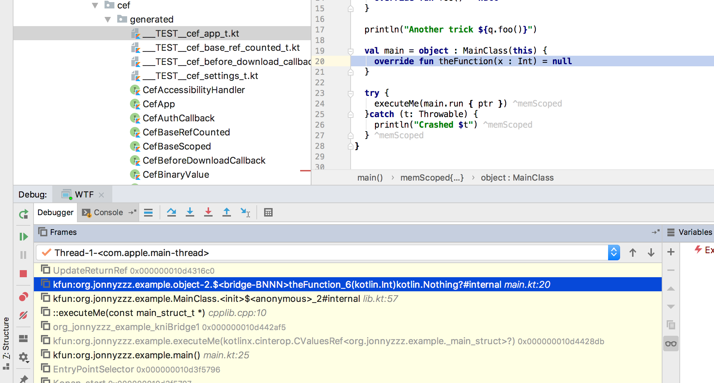

An experiment with Kotlin/Native, structs and C function pointers


The execution of the project fails as follows on macOS

```bash
./gradlew runDebugExecutableMacosX64

... Gradle output omitted ...

> Task :kn:runDebugExecutableMacosX64 FAILED
HEllo! 
Actual result of foo() : null
Another trick null

FAILURE: Build failed with an exception.

* What went wrong:
Execution failed for task ':kn:runDebugExecutableMacosX64'.
> Process 'command '/Users/jonnyzzz/Work/cef-kotlin-str/kn/build/bin/macosX64/debugExecutable/kn.kexe'' finished with non-zero exit value 139
```

See the debugger screenshot for more details:


As we see from the stacktrace: 
```cassandraql
UpdateReturnRef 0x000000010d4316c0
kfun:org.jonnyzzz.example.object-2.$<bridge-BNNN>theFunction_6(kotlin.Int)kotlin.Nothing?#internal main.kt:20
kfun:org.jonnyzzz.example.MainClass.<init>$<anonymous>_2#internal lib.kt:57
::executeMe(const main_struct_t *) cpplib.cpp:10
org_jonnyzzz_example_kniBridge1 0x000000010d442af5
kfun:org.jonnyzzz.example.executeMe(kotlinx.cinterop.CValuesRef<org.jonnyzzz.example._main_struct>?) 0x000000010d4428db
kfun:org.jonnyzzz.example.main() main.kt:25
EntryPointSelector 0x000000010d3f5796
Konan_start 0x000000010d3f5707
Konan_run_start 0x000000010d3f5681
main 0x000000010d3f55fb
start 0x00007fff7b114ed9
start 0x00007fff7b114ed9
```

The symbol
```
kfun:org.jonnyzzz.example.object-2.$<bridge-BNNN>theFunction_6(kotlin.Int)kotlin.Nothing?#internal main.kt:20
``` 
is quite unexpected, as it is likely to have `Nothing?` return type instead of a `CPointer<..>?`

